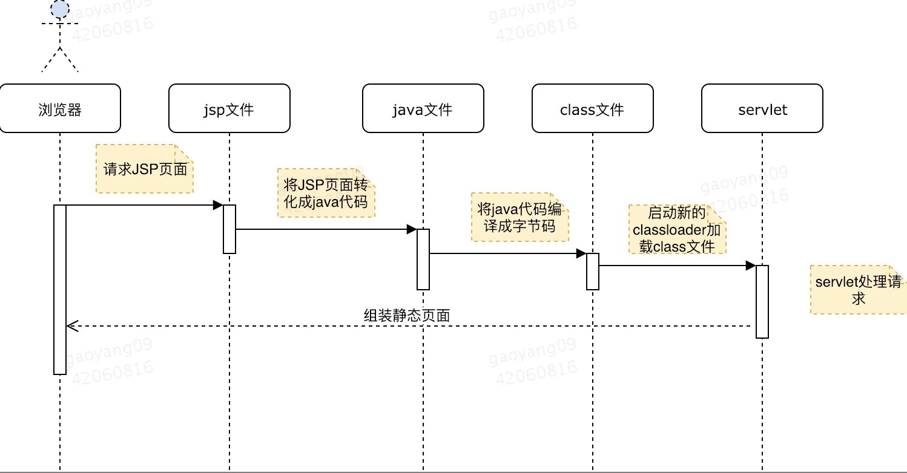

首先，我们清楚排查代码问题有多种方法，最简单的就是Debug一下，但如果是线上机器，没开Debug端口，那就得去看日志，看请求值和返回值分别是什么。如果没打印日志呢？改代码给代码加日志，重新发布。可是，怀疑是线程池的问题，重启之后破坏现场。那就只能选择排查问题的最高境界，通过Revew代码来发现问题。

但，至高境界只属于传说，今天我们就逃探讨如何动态追踪java。

先从jsp说起

大多数java程序员，最早就会接触jsp技术。然后我们会发现，修改jsp代码后，不需要重启jvm，只要刷新浏览器就行。可是，放到java代码中，修改，编译、替换class文件，发现新代码并没有生效。jsp为啥可以呢？

jsp文件修改后，web容器会检查请求jsp文件是否被修改，如果修改过，就将jsp文件重新解析成一个新的sevlet类，并加载到jvm中。在java类加载机制中，同一个calssLoader类不允许重复，为了绕开这个限制，每次都会创建一个新的ClassLoader实例，之后请求会由新的servlet来处理。

但是spring框架，无法通过创建新的classLoader实例方法来修改对象行为。

我们问题的本质就动态改变内存中已存在对象，所以先得弄清楚jvm中和对象行为有关的地方在哪里，有没有更改的可能性。

对象使用行为和属性来描述。

如何来存储对象的行为和属性呢？属性跟着对象走，每个对象存一份，行为是公共东西，抽离出来，单独放到一个地方。

我们先去找存储对象行为的公共地方。对象行为是存储在方法区的，方法区的数据是类加载时从calss文件中提取出来的，class文件是从源代码编译而来，源码码是程序员敲的。

​    倒着想，有没有办法加载一个已经加载过的类呢？

​    通过查询，我们发现一个方法 java.lang.instrument.Instrumentation

它有两个接口：redefineClasses和retransformClasses，都是替换已经存在的class文件。前者是自己提供字节码文件替换已经存在的类文件，后者是在已经存在的字节码文件上修改后再替换。

运行时直接替换类很不安全，极易引发异常。我们能做的就是简单修改方法内的一些行为。

我们把修改后的java文件重新编译得到class文件，然后调用redefineClasses替换。对于jvm来说，任何符合jvm规范的语言的源代码都可以编译成class文件。

直接操作字节码

java是程序员能读懂的语言，class是jvm能读懂的语言，但无论哪种语言都是人创造的，理论上人都能读懂。我们之所以使用高级语言知识为了开发效率，但一些杰出程序员创造了直接编辑字节码的框架。最著名的框架是ASM.

Spring对于字节码的操作就建立在ASM上，spring的AOP是基于动态代理实现的，会在运行时动态创建代理类，这里是指spring在运行中根据需求直接创造出一个class类文件，然后加载。而创造class文件的工件就是ASM.

我们知道了用ASM框架直接操作classs文件，在类中加一段打印日志的代码，然后调用retransfromClassses就可以。但没有没有更傻瓜一点的方法呢？

幸运的是，前辈们已经编写了很好用的工具，BTrace。

BTrace是一个基于java开发的提供动态追踪服务的工具。至于BTrace具体有哪些功能，脚本怎么下，网上有无数实例。

接下来我们了解一下BTrace的架构。

它主要有下面几个模块:

​    BTrace脚本：利用BTace定义的注解，我们根据需要进行脚本开发

​    Compiler:将脚本编译成BTrace class文件

​    Client:将文件发送到Agent

​    Agent:基于java的Attach Api，动态附着在一个运行的jvm上，开启一个BTrace Server，接收Client发送的BTrace脚本，解析脚本，然后根据规则找到要修改的类，修改字节码后，调用java的reTransform接口，完成对对象行为的修改并使之生效。

​    

BTrace有诸多限制，原则就是除了输出需要的信息，对整个程勋正常运行不造成影响。

BTrace已经很不错，但依旧需要一定的学习成本。阿里工程师把一些常用的功能封装起来，对外直接提供简单的命令操作，创造了自己的java诊断工具——Arthas。

总结：

​    java是静态语言，运行时不允许改变数据结构，然而在java5中引入Instruments，java6引入Attach API之后，虽然依旧存在诸多限制，但仅仅利用预留的只读的这一点点空间，仍然创造出了各种精彩的技术，提高了程序员定位问题的效率。

​    道经有言：道生一，一生二，二生三，三生万物。从电磁感应，到高低电压模拟0和1，再到二进制表示出基本数据类型，再到表示出无穷的对象。然后无穷的对象组合模拟出整个虚拟的宇宙。

​    时间在流逝，历史在发展，而最基本的智慧却永恒不变。
